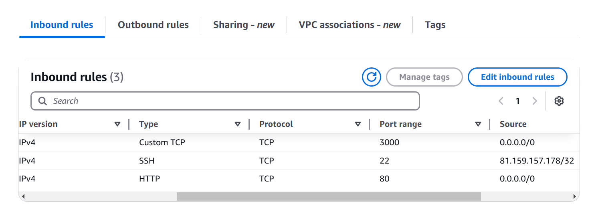

# Terraform AWS EC2 Deployment with Security Groups

This document details the steps to deploy an **AWS EC2 instance** using Terraform with a dedicated security group.

---

## ** Terraform Configuration**

### **`main.tf` - EC2 Instance Configuration**
```bash
provider "aws" {
  region = "eu-west-1"
}

resource "aws_instance" "app_instance" {
  # AMI ID for Ubuntu (Update if needed)
  ami = "ami-0c1c30571d2dae5c9"

  # Instance type
  instance_type = "t3.micro"

  # Attach the correct key pair
  key_name = "tech501-maram-key-2"

  # Assign a public IP
  associate_public_ip_address = true

  # Attach the security group
  vpc_security_group_ids = [aws_security_group.tech501_maram_sg.id]

  # Tags
  tags = {
    Name = "tech501-maram-terraform-app"
  }
}


```

- security-group.tf - Security Group Configuration

```bash
resource "aws_security_group" "tech501_maram_sg" {
  name        = "tech501-maram-tf-allow-port-22-3000-80"
  description = "Allow SSH, HTTP, and app port 3000"

  # Allow SSH from localhost (your IP)
  ingress {
    from_port   = 22
    to_port     = 22
    protocol    = "tcp"
    cidr_blocks = ["81.159.157.178/32"]  # Replace with your actual public IP
  }

  # Allow port 3000 from anywhere
  ingress {
    from_port   = 3000
    to_port     = 3000
    protocol    = "tcp"
    cidr_blocks = ["0.0.0.0/0"]
  }

  # Allow HTTP (port 80) from anywhere
  ingress {
    from_port   = 80
    to_port     = 80
    protocol    = "tcp"
    cidr_blocks = ["0.0.0.0/0"]
  }

  # Allow all outbound traffic
  egress {
    from_port   = 0
    to_port     = 0
    protocol    = "-1"
    cidr_blocks = ["0.0.0.0/0"]
  }

  tags = {
    Name = "tech501-maram-tf-allow-port-22-3000-80"
  }
}

```
2️⃣ Deployment Steps
1- Initialize Terraform: Run the following command to initialize Terraform:
```bash
terraform init
```
- Note: This command sets up Terraform and downloads necessary provider plugins.

2- Plan and Apply the Infrastructure: Check what Terraform will create:
```bash
terraform plan
```

3- Deploy the resources: 
```bash
terraform apply 
```
⚠️ Warning: terraform apply makes real changes to AWS.

- Do Not Share These Files on a public repo
    - .terraform/ folder → Contains provider plugins, do not share in public repositories.
    - terraform.tfstate → Stores the actual state of infrastructure, should be kept private.
    - terraform.tfstate.backup → Backup of state, also confidential.

4️- Destroying Infrastructure (Destructive Action): To remove all resources created by Terraform:
```bash
terraform destroy
```
⚠️ Warning: This will permanently delete your EC2 instance and security group.

- Successful Deployment Screenshot: The EC2 instance was created successfully with the required security groups
